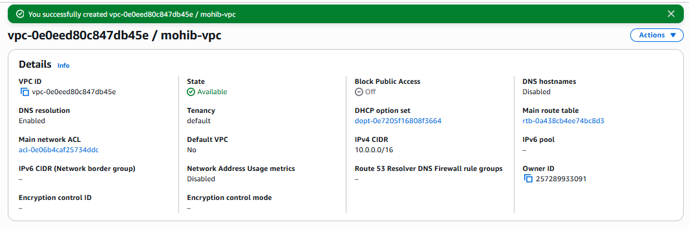
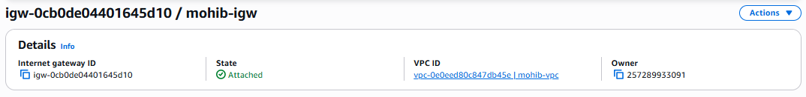
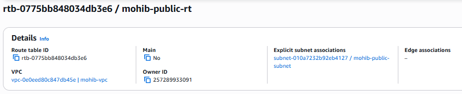
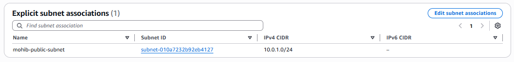
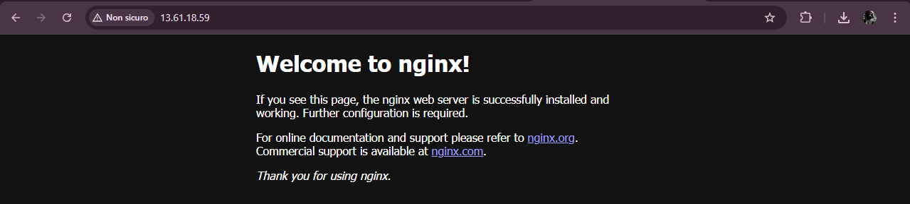
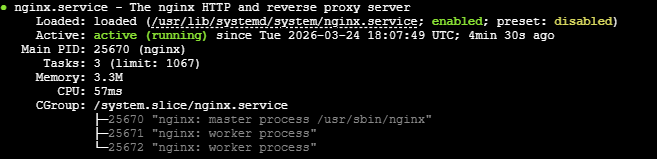
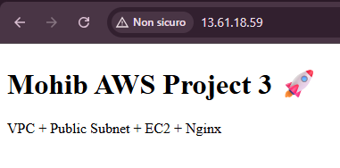
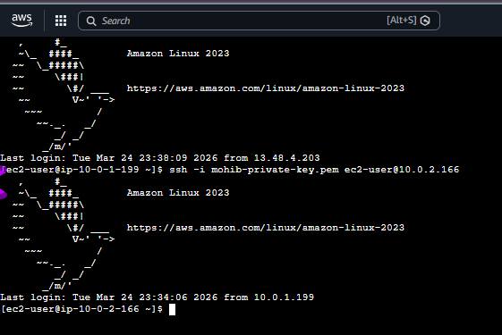

# 🚀 AWS VPC Project 3 – Public & Private Subnet + Bastion Host + Nginx
## 📌 Project Overview

In this project, I built a more advanced AWS architecture using a custom VPC with public and private subnets.
The goal was to understand how AWS networking really works and how to securely access a private server using a public one (bastion host), just like in real-world scenarios.

## ⚙️ Step 1
Creating the VPC
I started by creating my own VPC (Virtual Private Cloud), which is basically a private network in AWS.
Name: mohib-vpc
CIDR block: 10.0.0.0/16
I chose /16 because it provides a large IP range. Even though this is a project, it's a good practice to think about scalability from the beginning.

## 🌐 Step 2
Creating Subnets
Then I created two subnets:
Public subnet → 10.0.1.0/24
Private subnet → 10.0.2.0/24
Each subnet is inside one Availability Zone.

Why I did this:
Separating public and private resources improves security
/24 gives 256 IPs, which is more than enough for a subnet
At this point, the public subnet still had no internet access (no routing yet)

## 🌍 Step 3
Internet Gateway
I created an Internet Gateway (mohib-igw) and attached it to my VPC.
This acts like a bridge between my VPC and the internet.
At this stage, it still didn’t work because a route table was missing.

## 🔀 Step 4
Route Table Configuration
I created a route table and associated it with the public subnet.
Then I added:
10.0.0.0/16 → local (internal VPC communication)
0.0.0.0/0 → Internet Gateway (internet access)
Now the public subnet could access the internet.
The private subnet was intentionally left isolated.

## 🖥️ Step 5
Launching EC2 Public Instance
I launched an EC2 instance in the public subnet.
Configuration:
Auto-assign Public IP → enabled
Security Group:
SSH (22) → My IP
HTTP (80) → 0.0.0.0/0
This instance acts as:
Web server (Nginx)
Bastion host

## 🧪 Step 6
Installing Nginx & Deploying Website
After connecting to the EC2 instance:
sudo yum update -y
sudo yum install nginx -y
sudo systemctl start nginx
sudo systemctl enable nginx
Then:
I opened the public IP in the browser
Saw the default Nginx page → confirmed it works
After that:
cd /usr/share/nginx/html
Edited index.html
Added my custom HTML
Refreshed the browser
👉 My website was live

## 🔐 Step 7
Private EC2 + Bastion Host (Troubleshooting)
Then I created a second EC2 instance inside the private subnet (no public IP).
The goal was:
👉 Access it only through the public EC2 (bastion host)
At this point, I spent a lot of time troubleshooting because SSH was not working.
After many tests and debugging, I found the real issue:
👉 The Security Group of the private EC2 was configured incorrectly
Initially, I allowed SSH from anywhere, but that didn’t work properly in this architecture.

## ✅ Final Fix
The correct configuration was:
Private EC2 Security Group:
SSH (22) → Source: Security Group of public EC2
This means:
👉 Only the public EC2 can connect to the private one
After fixing this, the connection finally worked:
ssh -i key.pem ec2-user@10.0.2.xxx
This was the most important part of the project because I learned how real troubleshooting works in AWS.

## 🧠 Architecture
 Internet
   ↓
 [ EC2 Public (Nginx + Bastion Host) ]
   ↓
 [ EC2 Private ]

## 🌐 Live Website
http://13.61.18.59

## 📸 Screenshots

### VPC

### Subnets

### Internet Gateway

### Route Table

### Route Association

### EC2 Public

### Nginx Status

### Nginx Default Page

### Live Website

### EC2 Private

### Bastion Access

## 🎯 What I Learned
How to create a VPC from scratch
Difference between public and private subnets
How Internet Gateway works
How Route Tables control traffic
How to deploy a web server with EC2 + Nginx
How Security Groups control access
How to connect to a private EC2 using a bastion host
How to troubleshoot real AWS networking issues
🔧 Problems Solved
Fixed SSH access to private EC2 (Security Group misconfiguration)
Understood how traffic flows between subnets
Debugged networking issues step by step

## 👨‍💻 Author
Muhammad Mohib
